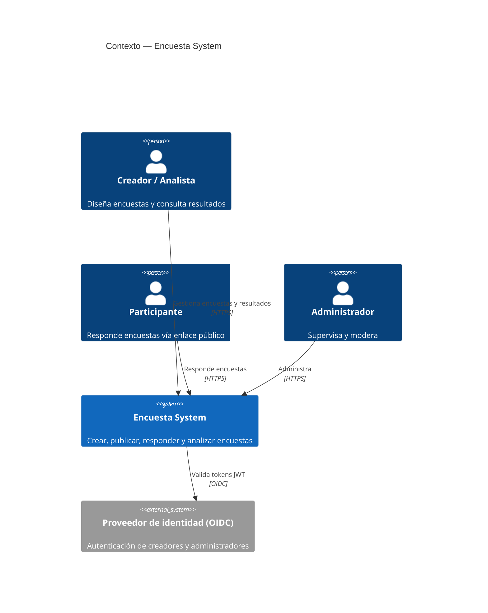
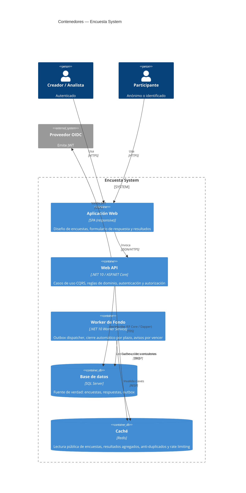
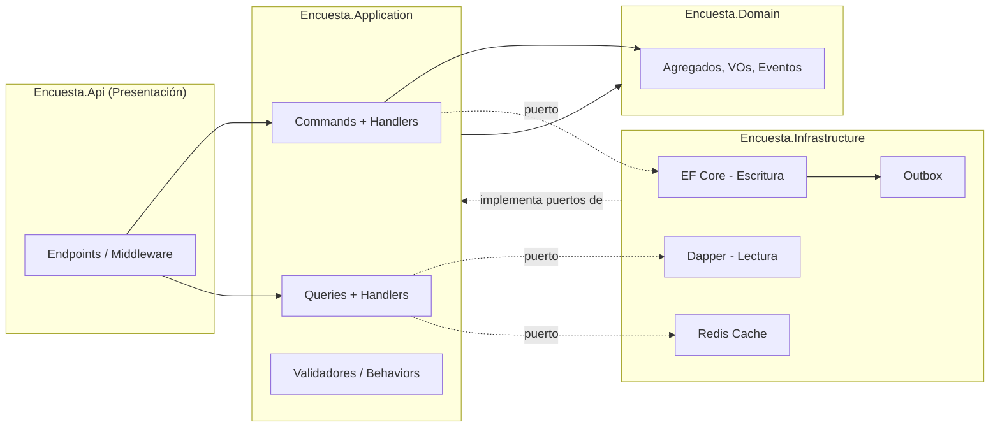
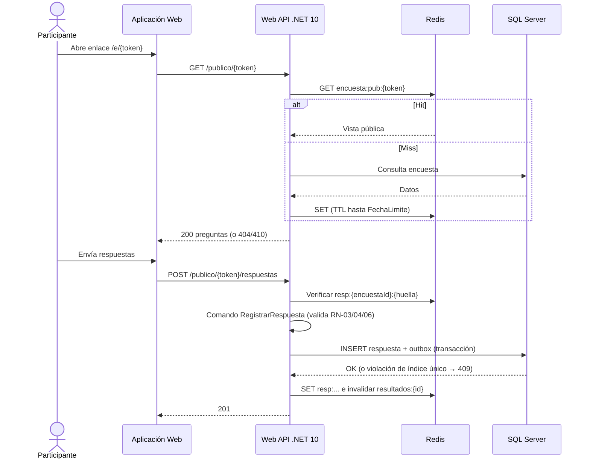

# Arquitectura C4 — Contenedores

Complementa [domain-model.md](domain-model.md). Decisión de estilo: [ADR-001](adr/ADR-001-clean-architecture-cqrs.md).

## 1. Nivel 1 — Contexto del sistema

## 2. Nivel 2 — Contenedores

## 3. Responsabilidades por contenedor

| Contenedor | Tecnología | Responsabilidad | Historias |
|------------|-----------|-----------------|-----------|
| Aplicación Web | SPA responsive | UI de creación, respuesta (móvil) y resultados | HU-01…05 |
| **Web API** | **.NET 10**, ASP.NET Core Minimal APIs, MediatR/handlers propios | Comandos y consultas, validación, autorización por propietario, exportación CSV | HU-01…05 |
| Worker de Fondo | .NET 10 Worker Service | Despachar outbox, `CerrarSiVencida`, emitir `EncuestaPorVencer` | HU-04 |
| **SQL Server** | SQL Server 2022+ | Persistencia transaccional; índice único `(EncuestaId, ParticipanteId)` para RF-05; tabla `Outbox` | Todas |
| **Redis Cache** | Redis 7+ | Ver §4 | HU-03, HU-05 |

## 4. Uso de Redis

| Clave | Contenido | TTL / invalidación | Motivo |
|-------|-----------|--------------------|--------|
| `encuesta:pub:{token}` | Vista pública (preguntas, estado, fecha límite) | Hasta `FechaLimite` o evento `EncuestaCerrada` | Ruta más concurrida (HU-03) sin tocar SQL |
| `resultados:{encuestaId}` | Agregados por pregunta | 30 s + invalidación con `RespuestaRegistrada` | OB-04: resultados < 5 s |
| `resp:{encuestaId}:{huella}` | Marca de "ya respondió" (cookie/token de un solo uso en anónimas) | Hasta `FechaLimite` | Verificación rápida RF-05; la garantía final es el índice único en SQL |
| `rl:{ip}:{ruta}` | Contador de tasa | Ventana deslizante 1 min | Mitiga abuso/bots del enlace público |

Reglas: Redis **nunca es fuente de verdad**; ante fallo de Redis la API degrada a SQL (cache-aside con *fail-open*). La unicidad de respuesta se garantiza en SQL Server.

## 5. Estructura interna de la Web API (Clean Architecture)

Dependencias: `Api → Application → Domain`; `Infrastructure → Application/Domain`. El dominio no referencia nada externo.

## 6. Flujo clave: responder encuesta (HU-03)

## 7. Requisitos no funcionales y decisiones

| Atributo | Meta | Táctica |
|----------|------|---------|
| Rendimiento | Lectura pública p95 < 200 ms; resultados < 5 s | Redis cache-aside; consultas con Dapper sobre proyecciones |
| Consistencia | RF-05 sin duplicados | Índice único en SQL + verificación previa en Redis |
| Disponibilidad | Degradación si cae Redis | *Fail-open* a SQL |
| Seguridad | Autorización por propietario; anonimato (RN-06) | JWT/OIDC, política por recurso; no persistir identidad en anónimas; rate limiting |
| Observabilidad | Trazabilidad extremo a extremo | OpenTelemetry (trazas, métricas, logs), health checks |
| Evolución | Escalar lecturas/escrituras por separado | CQRS ([ADR-001](adr/ADR-001-clean-architecture-cqrs.md)); réplicas de lectura futuras |
| Despliegue | Contenedores | Docker; API y Worker escalan de forma independiente |
