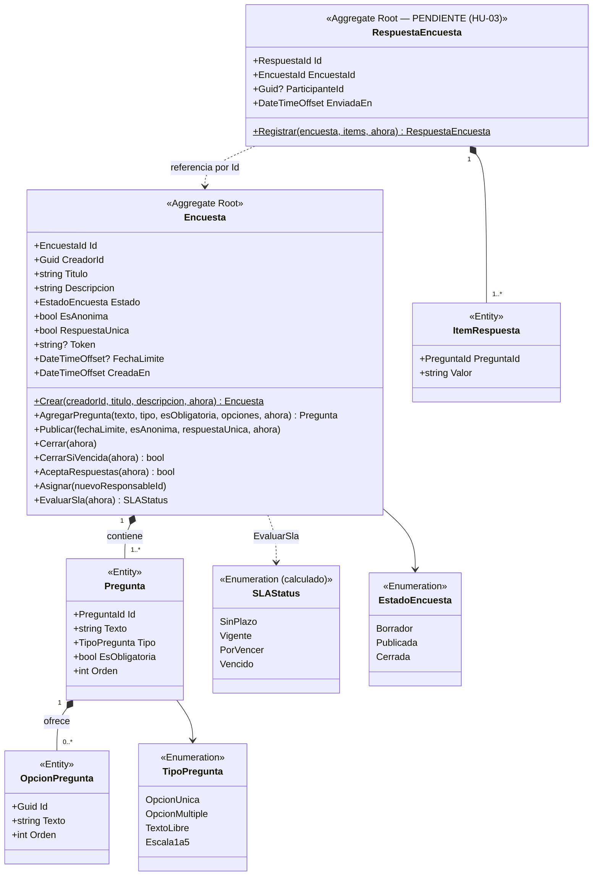
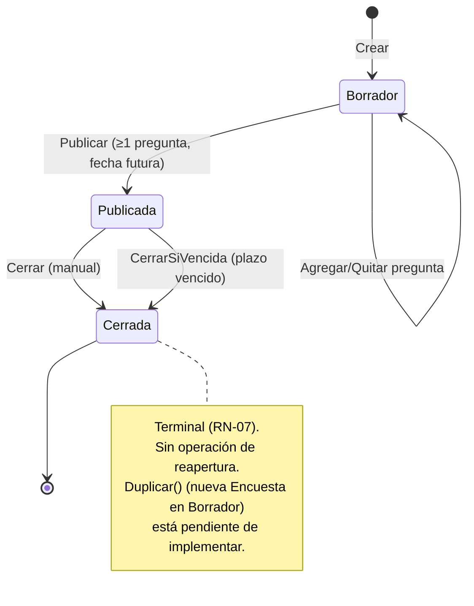
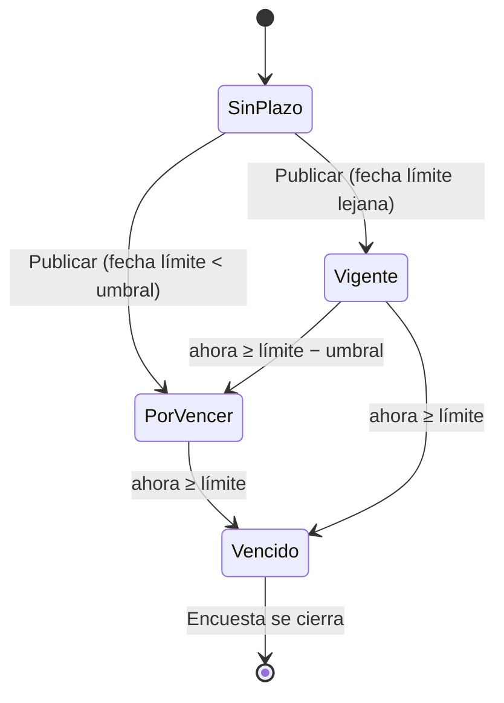
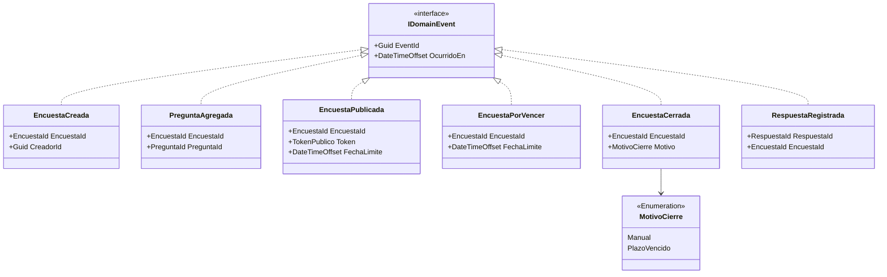
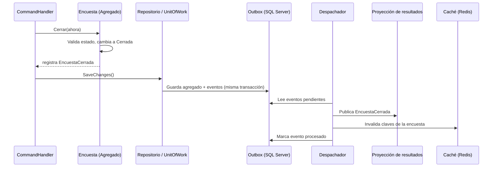

# Modelo de Dominio — Módulo Encuesta

Deriva de [01-vision-document.md](../specs/functional/01-vision-document.md) (RF/RN) y [02-user-stories.md](../specs/functional/02-user-stories.md) (HU-01…HU-05).

> **Supuesto:** las especificaciones no definen "SLAStatus" explícitamente. Se modela como el **estado del plazo de respuesta** de la encuesta (fecha límite, RN-03 / HU-04 cierre automático). En el código es un enum calculado por `Encuesta.EvaluarSla(ahora)`. Ajustar si el término tiene otro significado de negocio.

> **Sincronizado con el código el 2026-09-26** (auditoría: [../audit/drift-report.md](../audit/drift-report.md)). Los diagramas de las secciones 3 a 5 reflejan lo **implementado** en `src/Encuesta.Domain`; lo pendiente figura en la sección 0.

## 0. Estado de implementación

| Elemento del diseño | Estado | Nota |
|---|---|---|
| Agregado `Encuesta` (`Crear`, `AgregarPregunta`, `Publicar`, `Cerrar`, `CerrarSiVencida`, `AceptaRespuestas`, `EvaluarSla`) | ✅ Implementado | 37 pruebas unitarias en verde |
| `Asignar(nuevoResponsableId)` | ✅ Implementado | No estaba en el diseño original; nace del contrato `PUT /assign` |
| `SLAStatus` | ✅ Implementado | Enum calculado, no persistido |
| `Pregunta`, `OpcionPregunta`, `MotivoCierre` | ✅ Implementado | |
| Eventos `EncuestaCreada`, `PreguntaAgregada`, `EncuestaPublicada`, `EncuestaCerrada` | 🟡 Se generan, no se despachan | No hay outbox ni manejadores; `ClearDomainEvents` no se invoca |
| Eventos `EncuestaPorVencer`, `RespuestaRegistrada` | ❌ Pendiente | |
| `QuitarPregunta`, `Duplicar` | ❌ Pendiente | Necesarios para HU-01 (editar) y HU-04 (reabrir → duplicar) |
| `RespuestaEncuesta` / `ItemRespuesta` | ❌ Pendiente | HU-03 |
| `PlazoRespuesta`, `TokenPublico` (Value Objects) | ➖ Simplificado | En el código son `DateTimeOffset? FechaLimite` y `string Token` (32 hex) |
| Reloj inyectable | ➖ Difiere | Se usa `TimeProvider` de .NET, no `IClock` |

## 1. Lenguaje ubicuo

| Término | Definición |
|---------|------------|
| Encuesta | Agregado raíz: conjunto de preguntas publicable para recolectar respuestas |
| Pregunta | Entidad interna con tipo (OpcionUnica, OpcionMultiple, TextoLibre, Escala1a5), obligatoriedad y opciones |
| Respuesta | Envío completo de un participante a una encuesta |
| Estado | `Borrador → Publicada → Cerrada` (irreversible, RN-07) |
| Plazo (SLA) | Ventana de tiempo en que la encuesta acepta respuestas |
| Token público | Identificador opaco del enlace de respuesta |

## 2. Agregados y límites transaccionales

- **Encuesta** (raíz) contiene `Pregunta` y `OpcionPregunta`. Toda modificación pasa por la raíz.
- **RespuestaEncuesta** es un agregado separado (alto volumen, escritura concurrente) que referencia a la encuesta solo por `EncuestaId`. Se separa para no bloquear la encuesta al recibir respuestas.

## 3. Agregado `Encuesta`

### 3.1 Invariantes (reglas de negocio protegidas por el agregado)

| Invariante | Regla | Dónde se aplica |
|-----------|-------|-----------------|
| Título obligatorio | HU-01 | `Encuesta.Crear` |
| Opción única/múltiple con ≥ 2 opciones | RN-05 | `AgregarPregunta` |
| Publicar requiere ≥ 1 pregunta | RN-01 | `Publicar` |
| Fecha límite futura | HU-02 | `Publicar` |
| Preguntas inmutables tras publicar | RN-02 | `AgregarPregunta` exige `Borrador` (`QuitarPregunta` pendiente) |
| Solo cerrar si `Publicada` | HU-04 | `Cerrar` |
| Cerrada no reabre; se duplica | RN-07 | Sin operación de reapertura (implementado); `Duplicar()` pendiente |
| Acepta respuestas solo si `Publicada` y plazo no vencido | RN-03 | `AceptaRespuestas` |
| Obligatorias respondidas | RN-04 | `RespuestaEncuesta.Registrar` (pendiente) |
| Anónima ⇒ sin `ParticipanteId` | RN-06 | `RespuestaEncuesta.Registrar` (pendiente) |
| Una respuesta por participante (si `RespuestaUnica`) | RF-05 | Servicio de dominio + índice único en BD (pendiente) |

### 3.2 Ciclo de vida

## 4. `SLAStatus` (estado del plazo)

Se calcula, **no se persiste** como fuente de verdad: es función de `FechaLimite` y la hora actual (inyectada vía `TimeProvider` de .NET para pruebas deterministas; en las pruebas se usa un proveedor fijo).

| Valor | Condición | Efecto |
|-------|-----------|--------|
| `SinPlazo` | Encuesta en `Borrador` (sin fecha límite) | No aplica |
| `Vigente` | `ahora < FechaLimite − umbral` | Acepta respuestas |
| `PorVencer` | `FechaLimite − umbral ≤ ahora < FechaLimite` (umbral por defecto 24 h) | Acepta respuestas; dispara aviso al creador |
| `Vencido` | `ahora ≥ FechaLimite` | Rechaza respuestas; candidata a cierre automático |

## 5. Eventos de dominio (`DomainEvents`)

Se emiten desde el agregado (`AggregateRoot.Raise`). **Diseño objetivo:** se recogen al confirmar la transacción (patrón *outbox*) y se publican a los manejadores. **Estado actual:** los eventos se acumulan en memoria en `DomainEvents` y no se persisten ni se despachan (no existe outbox, despachador ni manejadores); `EncuestaPorVencer` y `RespuestaRegistrada` no están implementados. El flujo 5.1 describe el diseño objetivo.

| Evento | Origen (operación) | Historia | Reacciones |
|--------|--------------------|----------|-----------|
| `EncuestaCreada` | `Encuesta.Crear` | HU-01 | Auditoría |
| `PreguntaAgregada` | `AgregarPregunta` | HU-01 | Auditoría |
| `EncuestaPublicada` | `Publicar` | HU-02 | Registrar en caché de lectura pública; auditoría |
| `EncuestaPorVencer` | Job de plazos | HU-04 | Notificar al creador |
| `EncuestaCerrada` | `Cerrar` / `CerrarSiVencida` | HU-04 | Invalidar caché pública y de resultados; auditoría |
| `RespuestaRegistrada` | `RespuestaEncuesta.Registrar` | HU-03 | Actualizar contadores/proyección de resultados; invalidar caché de resultados |

### 5.1 Flujo de eventos

## 6. Trazabilidad historia → dominio

| Historia | Operaciones del dominio | Eventos |
|----------|-------------------------|---------|
| HU-01 Crear | `Crear`, `AgregarPregunta`, `QuitarPregunta` | `EncuestaCreada`, `PreguntaAgregada` |
| HU-02 Publicar | `Publicar` | `EncuestaPublicada` |
| HU-03 Responder | `AceptaRespuestas`, `RespuestaEncuesta.Registrar` | `RespuestaRegistrada` |
| HU-04 Cerrar | `Cerrar`, `CerrarSiVencida`, `Duplicar` | `EncuestaPorVencer`, `EncuestaCerrada` |
| HU-05 Resultados | Solo lectura (modelo de consulta, ver [c4-containers.md](c4-containers.md)) | — |
