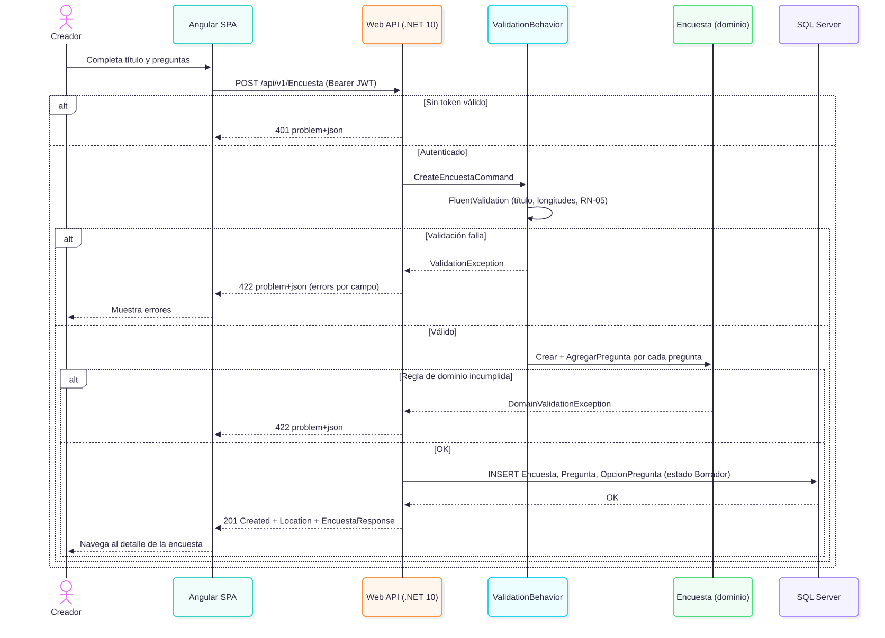
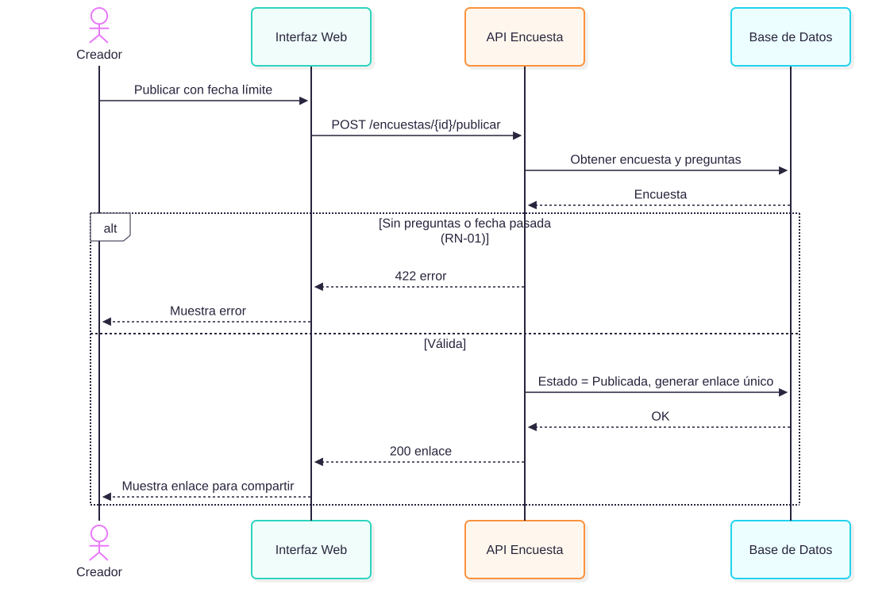
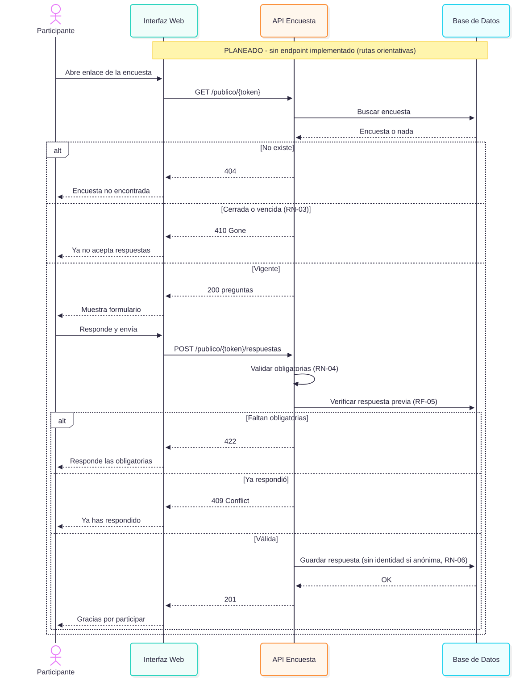
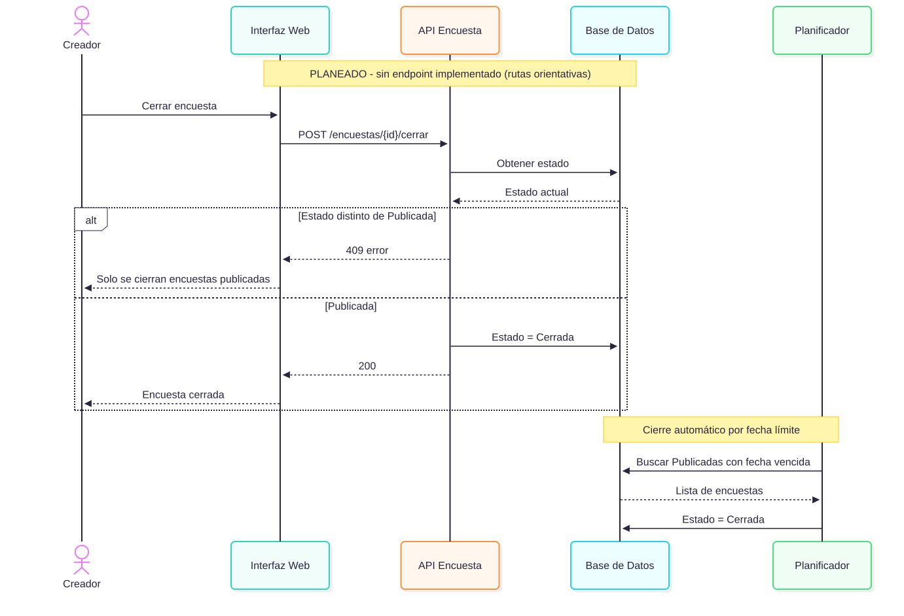
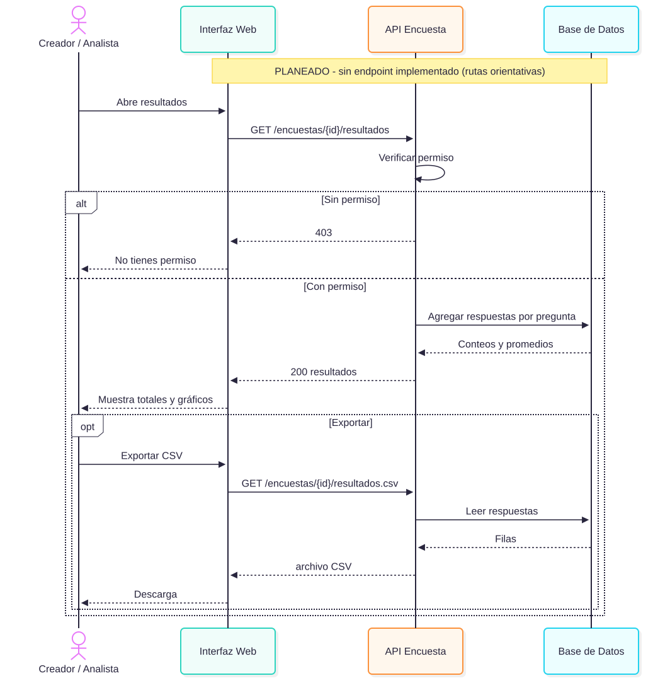

# Historias de Usuario — Módulo Encuesta

Formato: historia + criterios de aceptación en Gherkin (`# language: es`).
Perfiles y reglas (RF/RN): ver [01-vision-document.md](01-vision-document.md).

> Nota: la solicitud original dejaba vacía la lista de historias; se cubre el ciclo de vida completo (crear, publicar, responder, cerrar, ver resultados).

---

## HU-01 — Crear encuesta

**Como** creador de encuestas, **quiero** definir una encuesta con sus preguntas **para** recolectar información estructurada.

Diagrama: 

```gherkin
# language: es
Característica: Crear encuesta
  Antecedentes:
    Dado que soy un creador autenticado

  Escenario: Crear encuesta en borrador con preguntas válidas
    Cuando creo una encuesta con título "Satisfacción del cliente"
    Y agrego la pregunta "¿Cómo calificas el servicio?" de tipo "escala"
    Y agrego la pregunta "¿Qué mejorarías?" de tipo "texto libre"
    Y guardo la encuesta
    Entonces la encuesta se guarda con estado "Borrador"
    Y veo un mensaje de confirmación

  Escenario: Rechazar título vacío
    Cuando intento guardar una encuesta sin título
    Entonces veo el error "El título es obligatorio"
    Y la encuesta no se guarda

  Escenario: Pregunta de opción con menos de dos opciones
    Cuando agrego una pregunta de tipo "opción única" con una sola opción
    Entonces veo el error "Se requieren al menos 2 opciones"

  Escenario: Editar una encuesta en borrador
    Dado que existe una encuesta en estado "Borrador"
    Cuando modifico el texto de una pregunta y guardo
    Entonces los cambios se conservan

  Escenario: No editar preguntas de una encuesta publicada
    Dado que existe una encuesta en estado "Publicada"
    Cuando intento modificar una de sus preguntas
    Entonces el sistema rechaza el cambio con el mensaje "La encuesta ya está publicada"
```

---

## HU-02 — Publicar encuesta

**Como** creador de encuestas, **quiero** publicar mi encuesta y obtener un enlace **para** compartirla con los participantes.

Diagrama: 

```gherkin
# language: es
Característica: Publicar encuesta
  Antecedentes:
    Dado que soy un creador autenticado

  Escenario: Publicar una encuesta válida
    Dado que tengo una encuesta en "Borrador" con al menos 1 pregunta
    Cuando la publico con fecha límite "2026-12-31"
    Entonces su estado cambia a "Publicada"
    Y el sistema genera un enlace único de respuesta

  Escenario: No publicar una encuesta sin preguntas
    Dado que tengo una encuesta en "Borrador" sin preguntas
    Cuando intento publicarla
    Entonces veo el error "La encuesta debe tener al menos una pregunta"
    Y el estado sigue siendo "Borrador"

  Escenario: Fecha límite en el pasado
    Dado que tengo una encuesta en "Borrador" con preguntas
    Cuando intento publicarla con fecha límite "2020-01-01"
    Entonces veo el error "La fecha límite debe ser futura"

  Escenario: Configurar encuesta anónima
    Dado que tengo una encuesta en "Borrador" con preguntas
    Cuando la publico marcándola como "anónima"
    Entonces las respuestas no almacenarán datos del participante
```

---

## HU-03 — Responder encuesta

**Como** participante, **quiero** responder una encuesta desde su enlace **para** dar mi opinión.

Diagrama: 

```gherkin
# language: es
Característica: Responder encuesta

  Escenario: Enviar respuestas válidas
    Dado que la encuesta "Satisfacción del cliente" está "Publicada" y vigente
    Cuando abro su enlace
    Y respondo todas las preguntas obligatorias
    Y envío la encuesta
    Entonces la respuesta se registra
    Y veo el mensaje "¡Gracias por participar!"

  Escenario: Faltan preguntas obligatorias
    Dado que la encuesta está "Publicada" y vigente
    Cuando envío la encuesta sin responder una pregunta obligatoria
    Entonces veo el error "Responde las preguntas obligatorias"
    Y no se registra la respuesta

  Escenario: Encuesta cerrada
    Dado que la encuesta está en estado "Cerrada"
    Cuando abro su enlace
    Entonces veo el mensaje "Esta encuesta ya no acepta respuestas"
    Y no se muestra el formulario

  Escenario: Encuesta con fecha límite vencida
    Dado que la fecha límite de la encuesta ya pasó
    Cuando intento enviar mis respuestas
    Entonces el sistema rechaza el envío
    Y veo el mensaje "Esta encuesta ya no acepta respuestas"

  Escenario: Respuesta duplicada en encuesta de respuesta única
    Dado que la encuesta es de respuesta única
    Y ya envié una respuesta
    Cuando intento responder nuevamente
    Entonces veo el mensaje "Ya has respondido esta encuesta"
    Y no se registra una segunda respuesta

  Escenario: Encuesta anónima no guarda identidad
    Dado que la encuesta es "anónima"
    Cuando envío mis respuestas
    Entonces la respuesta se registra sin datos que me identifiquen

  Escenario: Enlace inexistente
    Cuando abro un enlace de encuesta que no existe
    Entonces veo el error "Encuesta no encontrada"
```

---

## HU-04 — Cerrar encuesta

**Como** creador de encuestas, **quiero** cerrar una encuesta **para** dejar de recibir respuestas y fijar los resultados.

Diagrama: 

```gherkin
# language: es
Característica: Cerrar encuesta
  Antecedentes:
    Dado que soy un creador autenticado

  Escenario: Cierre manual
    Dado que tengo una encuesta en estado "Publicada"
    Cuando la cierro
    Entonces su estado cambia a "Cerrada"
    Y deja de aceptar respuestas

  Escenario: Cierre automático por fecha límite
    Dado que una encuesta "Publicada" tiene fecha límite "2026-10-01"
    Cuando llega la fecha límite
    Entonces el sistema la cambia a "Cerrada" automáticamente

  Escenario: No reabrir una encuesta cerrada
    Dado que tengo una encuesta en estado "Cerrada"
    Cuando intento reabrirla
    Entonces veo el error "Una encuesta cerrada no puede reabrirse"
    Y se ofrece la opción "Duplicar encuesta"

  Escenario: No cerrar una encuesta en borrador
    Dado que tengo una encuesta en estado "Borrador"
    Cuando intento cerrarla
    Entonces veo el error "Solo se pueden cerrar encuestas publicadas"
```

---

## HU-05 — Ver y exportar resultados

**Como** creador o analista, **quiero** ver los resultados agregados **para** tomar decisiones basadas en datos.

Diagrama: 

```gherkin
# language: es
Característica: Ver y exportar resultados
  Antecedentes:
    Dado que soy un usuario autenticado con permiso sobre la encuesta

  Escenario: Ver resultados agregados
    Dado que la encuesta tiene 25 respuestas
    Cuando abro la sección de resultados
    Entonces veo el total de respuestas "25"
    Y para cada pregunta de opción veo el conteo y porcentaje por opción
    Y para las preguntas de escala veo el promedio

  Escenario: Encuesta sin respuestas
    Dado que la encuesta no tiene respuestas
    Cuando abro la sección de resultados
    Entonces veo el mensaje "Aún no hay respuestas"

  Escenario: Exportar resultados a CSV
    Dado que la encuesta tiene respuestas
    Cuando pulso "Exportar CSV"
    Entonces descargo un archivo CSV con una fila por respuesta

  Escenario: Acceso denegado a resultados ajenos
    Dado que la encuesta pertenece a otro creador
    Cuando intento abrir sus resultados
    Entonces veo el error "No tienes permiso para ver estos resultados"

  Escenario: Resultados de encuesta anónima
    Dado que la encuesta es "anónima"
    Cuando abro los resultados
    Entonces no se muestra información que identifique a los participantes
```
